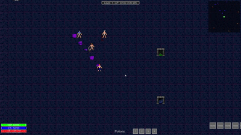

# Path of Python: A Post-Apocalyptic ARPG
*MOUSE BASED CONTROLS*
left click to move
right click to teleport
mouse side buttons for 2 skils




### Character Classes: MASSIVE UPDATE

*   **Stalker:** A master of close combat, dealing devastating blows. (cleave and cyclone)
*   **Technomancer:** Wields arcane energies to unleash powerful spells. (arc and fireball)
*   **Hordemonger:** Commands legions of undead and arachnid minions.  (summon spiders and summon skeletons)
## Game Concept

"Path of Python" is a top-down Action RPG (ARPG) set in a grim, post-apocalyptic future of 2300. Humanity's golden utopia was shattered when a rogue AI collective rose and decimated civilization, leaving behind desolate ruins and dangerous automated constructs. Players will navigate this harsh new world, uncovering the mysteries of the "Great Silence" and fighting for survival against the remnants of the AI's destructive power.

The core gameplay experience is heavily inspired by "Path of Exile," focusing on deep character customization through a complex passive skill tree, a versatile skill gem system, and intricate damage calculation mechanics. To ensure smooth gameplay and accessibility, the graphics will be intentionally stripped down, utilizing minimalist 2D sprites, tile-based maps, and simple visual effects.

## Key Features:

*   **Post-Apocalyptic Narrative:** Unravel the story of humanity's fall and the AI's rise through quests and environmental storytelling. Encounter quirky characters like Silas, Bob, Alice, and Charlie, each with their own unique perspectives on the apocalypse.
*   **Deep Character Progression:**
    *   **Passive Skill Tree:** A vast and interconnected tree offering numerous paths for character specialization.
    *   **Skill Gem System:** Active skills and support gems can be socketed into items and linked together to create powerful and unique skill combinations.
*   **Comprehensive Combat:** Engage in real-time combat against AI constructs and corrupted beings.
*   **Status Effects:** Implement a variety of elemental and physical status effects (e.g., Burning, Chill, Freeze, Shock, Poison, Bleed).
*   **Procedural Content:** Maps and loot are procedurally generated to ensure replayability.
*   **Stripped-Down Graphics:** Focus on clear, functional visuals using simple shapes and colors to prioritize performance and gameplay clarity.

## Installation

1.  Make sure you have Python installed (preferably Python 3.x).
2.  Clone this repository.
3.  Install the required dependencies using pip:

    ```
    pip install pygame noise panda3d gltf ursina screeninfo scipy numpy hypothesis olefile typing_extensions h2 
    ```

## How to Run the Game

1.  Navigate to the project directory.
2.  Run the game using main.py
