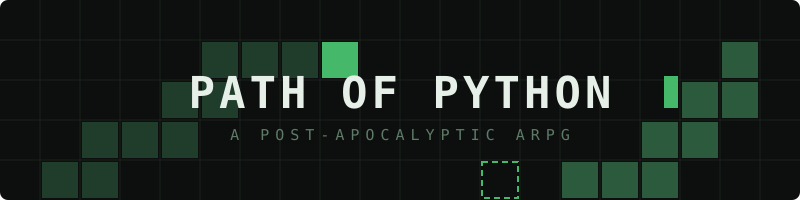
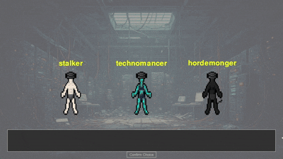
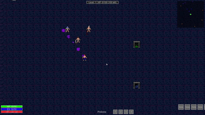

A top-down post-apocalyptic ARPG inspired by Path of Exile. Fast, mouse-driven combat with intentionally minimal 2D graphics.

Set in 2300, after a rogue AI collective shattered humanity's golden utopia. Navigate desolate ruins, fight automated constructs, and uncover the mysteries of the "Great Silence."






## Controls

Mouse-based:

* Left click to move
* Right click to teleport
* Mouse side buttons for 2 skills
* Number keys for dialog
* P to open the paste menu

## Classes

* **Stalker** — close combat. Cleave and cyclone.
* **Technomancer** — spells. Arc and ice nova.
* **Hordemonger** — summons undead and arachnid minions. Spiders and skeletons.

## Profit Paste Tree

Harvest Profit Paste from elite enemies to unlock upgrades in your class's paste tree (press P).

**Stalker**

* Empowered Cleave — cleave deals 40% more damage
* Reality Cleaver — every 5th cleave tears a rift, dealing 300% damage in a 10-tile cone and leaving a void that slows enemies 70% for 3 seconds
* Void Embrace — become smoke when death whispers
* Entropic Decay — enemies crumble in your shadow
* Paradox Armor — cheat death by 5 seconds

**Technomancer**

* Ghost Arc — lightning ignores walls (and mercy)
* Singularity Arc — arc chains infinitely, growing 20% stronger with each jump
* Overload Nova — double detonation plus a cryo minefield
* Quantum Entanglement — 15% chance to spell echo

**Hordemonger**

* Webweaver's Wrath — spiders leave lingering webs that slow and entangle
* Necrotic Plague — your minions spread terminal debt
* Skeleton Overlord — every 10th skeleton is an Overlord with 500% health and 200% damage
* Singularity Core — all damage has a 5% chance to collapse enemies into a micro-singularity

## Quests

Players fight the Profit Engine, an AI system that harvests humans for Profit Paste and enforces debt slavery through its Tithing Choir. Starting with rescuing a prisoner from processing, quests escalate to hacking corporate grids, raiding caravans, and stealing incriminating ledgers. Sequential, objective-driven missions build toward rebellion against the machine.

## Features

* Real-time combat against AI constructs and corrupted beings
* Status effects: burning, chill, freeze, shock, poison, bleed
* Procedurally generated maps (or hand-drawn with the dungeon generator GUI)
* Environmental storytelling with NPCs like Silas, Bob, Alice, and Charlie
* Stripped-down visuals for performance and clarity

## Install

```
pip install pygame noise==1.2.2
```

`noise` has no prebuilt wheels, so pip compiles it from source. On Windows that requires the [Microsoft C++ Build Tools](https://visualstudio.microsoft.com/visual-cpp-build-tools/); on Linux/macOS a C compiler and Python headers (`python3-dev`).

If you'd rather skip the compiler, just install pygame — the game falls back to a pure-Python noise implementation. Map generation is slower and produces different layouts for the same seed.

## Run

```
python main.py
```
